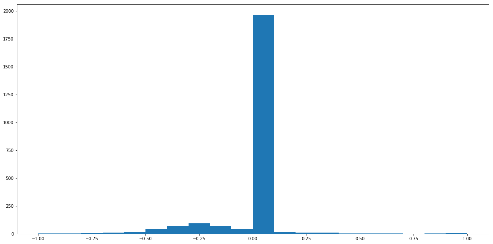
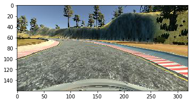
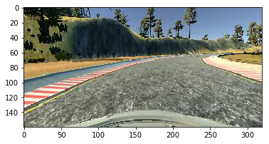

#**Behavioral Cloning** 


---

**Behavioral Cloning Project**

The goals / steps of this project are the following: 

* Use the simulator to collect data of good driving behavior  
* Build, a convolution neural network in Keras that predicts steering angles from images   
* Train and validate the model with a training and validation set   
* Test that the model successfully drives around track one without leaving the road   
* Summarize the results with a written report   


## Rubric Points
### Here I will consider the [rubric points](https://review.udacity.com/#!/rubrics/432/view) individually and describe how I addressed each point in my implementation.  

---
### Files Submitted & Code Quality

#### 1. Submission includes all required files and can be used to run the simulator in autonomous mode

My project includes the following files:
* model.py containing the script to create and train the model
* preprocessing.py containing helper functions   
* drive.py for driving the car in autonomous mode
* model.h5 containing a trained convolution neural network 
* writeup_report.md or writeup_report.pdf summarizing the results

#### 2. Submission includes functional code
Using the Udacity provided simulator and my drive.py file, the car can be driven autonomously around the track by executing 
```<span></span>h
python drive.py model.h5
```

#### 3. Submission code is usable and readable

The model.py file contains the code for training and saving the convolution neural network. The file shows the pipeline I used for training and validating the model, and it contains comments to explain how the code works.

### Model Architecture and Training Strategy

#### 1. An appropriate model architecture has been employed

My model consists of a convolution neural network with 3x3 filter sizes and depths between 3 and 64 (model.py lines 49-64) 

The model includes ELU layers to introduce nonlinearity, and the data is normalized in the model using a Keras lambda layer (code line 48). 

#### 2. Attempts to reduce overfitting in the model

The model contains dropout layers in order to reduce overfitting (model.py lines 53, 57...). All convolutional droput layer are set at 0.25 dropout rate and all fully connected droput layers are set at 0.5 dropout rate. 

The model was trained and validated on different data sets to ensure that the model was not overfitting (code line 18-23). The model was tested by running it through the simulator and ensuring that the vehicle could stay on the track.

#### 3. Model parameter tuning

The model used an adam optimizer, so the learning rate was not tuned manually (model.py line 77).

#### 4. Appropriate training data

Training data was chosen to keep the vehicle driving on the road. I used a combination of center lane driving, driving in reverse direction, driving at the side of road and driving at very slow speeds.

For details about how I created the training data, see the next section. 

### Model Architecture and Training Strategy

#### 1. Solution Design Approach

The overall strategy for deriving a model architecture was to have enough layers to learn representation of dataset.

My first step was to use a convolution neural network model similar to the LeNet architecture. I thought this model might be appropriate because it has sufficient number of convolutional layers and fully connected layers to classify images.

I splitted the dataset into training and validation set to test the performance of the model. The training process not converging, so I changed the optimizer from Adadelta to Adam.

After that I found out that the model training error is going down at each epoch, but the validation error starts increasing after few epochs. This happes when model starts to overfit the training data.
To combat overfitting, I added dropout layers.

After that I made changes to the model by adding more convolutional layers, and adding more fully connected layers. I also tried grayscale images instead of RGB images for training, but it didn't improve the error rates.

The final step was to run the simulator to see how well the car was driving around track one. There were a few spots where the vehicle fell off the track, to improve the driving behavior in these cases, I collected more data by driving with different variations.

At the end of the process, the vehicle is able to drive autonomously around the track without leaving the road.

#### 2. Final Model Architecture

The final model architecture is based on NVIDIA model for end to end learning. I added dropout and max pooling layer to it.
It (model.py lines 47-75) consisted of a convolution neural network with the following layers and layer sizes 

| Layer         		|     Description	        					| 
|:---------------------:|:---------------------------------------------:| 
| Input         		| 80x80x3 RGB image   					        | 
| Lambda         		| Normalization layer   					    |
| Convolution1     	    | kernel size: 3x3, Depth: 3	                |
| ELU					|												|
| Convolution2     	    | kernel size: 3x3, Depth: 24	                |
| ELU					|												|
| Max pooling	      	| pool size: 2x2  	                            |
| Dropout	      	    | rate: 0.25	                                |
| Convolution3     	    | kernel size: 3x3, Depth: 36	                |
| ELU					|												|
| Max pooling	      	| pool size: 2x2  	                            |
| Dropout	      	    | rate: 0.25	                                |
| Convolution4     	    | kernel size: 3x3, Depth: 48	                |
| ELU					|												|
| Max pooling	      	| pool size: 2x2  	                            |
| Dropout	      	    | rate: 0.25	                                |
| Convolution5     	    | kernel size: 3x3, Depth 64	                |
| ELU					|												|
| Max pooling	      	| pool size: 2x2  	                            |
| Dropout	      	    | rate: 0.25	                                |
| Fully connected1		| size: 1164       				                |
| Dropout				| rate: 0.50									|
| Fully connected2		| size: 100       				                |
| Dropout				| rate: 0.50									|
| Fully connected3		| size: 50       				                |
| Dropout				| rate: 0.50									|
| Fully connected4		| size: 10       				                |
| Dropout      		    | rate: .50       				                |
| Fully connected5		| size: 1       				                |
| tanh		            | size: 1       				                |


#### 3. Creation of the Training Set & Training Process

I collected dataset using following methods

1. Recorded 2 laps driving fast around the track.   
2. Recorded 1 lap driving fast around the track in reverse direction.
3. Recorded 1 lap in driving slow along the left edge of the lap.
4. Recorded 1 lap in driving slow around the track keeping vehicle centered.
5. Recorded 1 lap in driving slow around the track in reverse direction keeping the vehicle centered.


After plotting histogram for the steering angle, I found out that most of the example have steering angle set to zero.



To fix this I randomly removed images with steering angle 0 ( preprocessing.py 56-71).

I am only using the center images for training purpose. I think randomly setting right/left images angle is not a good decision.

Also, I am also flipping all the images to augment the dataset.

Image before flipping



Image after flipping



After the collection process, I had 22780 number of data points. I then preprocessed this data by

1. Cropping out the image to remove sky and hood area.   
2. Resizing the image to (80, 80) for fast training.

Since all the data easily fits in memory I did not used generetor functions.

Finally, I randomly shuffled the data set and put 20% of the data into a validation set. 

I used this training data for training the model. The validation set helped determine if the model was over or under fitting. The ideal number of epochs was 30. I used an adam optimizer so that manually training the learning rate wasn't necessary.

